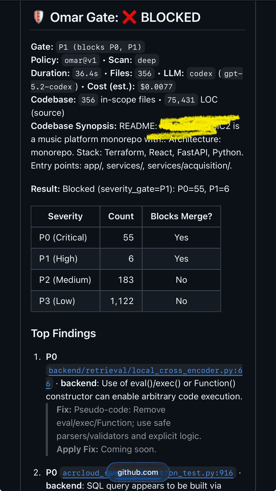

# Omar Gate

**AI-powered security gate that blocks P0/P1 vulnerabilities before merge.**

[](https://github.com/mrrCarter/sentinelayer-v1-action)
[](LICENSE)
[](https://github.com/mrrCarter/sentinelayer-v1-action/actions/workflows/quality-gates.yml)
[](https://github.com/marketplace?query=sentinelayer)

Omar Gate runs a 7-layer security analysis on every pull request — combining deterministic pattern scanning, codebase-aware ingestion, and deep AI-powered code review — then blocks the merge if critical vulnerabilities are found.

Built by engineers, for engineers. No vendor lock-in. Bring your own LLM.

## Recommended: Start with Spec Builder

If you're building a new feature or a new app, start here first:

**[Sentinelayer Spec Builder](https://sentinelayer.com/spec-builder)**

Tell our AI what you want to build (or connect your repo), then it generates:
- a project spec sheet
- an AI builder prompt you can paste into Cursor, Claude Code, Copilot, or any coding agent
- Omar Gate setup aligned to that spec
- a phase-by-phase build guide

Why this is better than doing everything manually:
- you get one coherent contract for product, architecture, and security from day one
- Omar is wired for you and stays tied to the spec, so PR reviews enforce the same requirements every time
- you reduce prompt drift, rework, and inconsistent implementation decisions

If you cannot get setup working, we can help. Use Spec Builder first, then follow the Quick Start below for direct GitHub Action install.

---

## Quick Start

Create `.github/workflows/security-review.yml` in your repository:

```yaml
name: Security Review

on:
  pull_request:
    types: [opened, synchronize]

permissions:
  contents: read
  pull-requests: write
  checks: write

jobs:
  security-review:
    runs-on: ubuntu-latest
    steps:
      - uses: actions/checkout@v4

      - name: Omar Gate
        id: omar
        uses: mrrCarter/sentinelayer-v1-action@v1
        with:
          sentinelayer_token: ${{ secrets.SENTINELAYER_TOKEN }}
          scan_mode: deep
          severity_gate: P1
          playwright_mode: baseline
          sbom_mode: baseline

      - name: Upload Artifacts
        if: always()
        uses: actions/upload-artifact@v4
        with:
          name: sentinelayer-${{ steps.omar.outputs.run_id }}
          path: .sentinelayer/runs/${{ steps.omar.outputs.run_id }}
          if-no-files-found: warn
```

That's it. Open a PR and Omar Gate will:
1. Scan your codebase for secrets, vulnerabilities, and misconfigurations
2. Run AI-powered deep analysis on high-risk files
3. Post a detailed security report as a PR comment
4. Block the merge if P0/P1 issues are found
5. Upload full audit artifacts for download

> **Required input:** `sentinelayer_token`. This action is a GitHub App bridge and authenticates against Sentinelayer API using that bearer token.
>
> **Compatibility note:** `openai_api_key`, `anthropic_api_key`, `google_api_key`, and `github_token` are legacy inputs from older action variants and are not required by this bridge action.

### Why `SENTINELAYER_TOKEN` is required

`sentinelayer_token` is the trust contract between your workflow and Sentinelayer API.  
Without it, the bridge cannot trigger scans or poll run status, and Omar Gate fails closed.

- `GITHUB_TOKEN` is GitHub-scoped and cannot authenticate to Sentinelayer API.
- `SENTINELAYER_TOKEN` is Sentinelayer-scoped and should be stored only in Actions secrets.
- Keep one canonical token per environment and rotate it on your security cadence.

### Preferred setup: no-copy CLI bootstrap

Use the Sentinelayer scaffold CLI to avoid manual token copy/paste:

```bash
npx create-sentinelayer@latest my-agent-app
```

The CLI opens browser auth, issues a bootstrap token, writes `.env`, and can inject `SENTINELAYER_TOKEN` into your repo secrets automatically.

### Fastest Installer Setup (recommended)

Use one organization-level Actions secret and reuse it across repos:

```bash
gh secret set SENTINELAYER_TOKEN --org <your-org> --visibility all
```

Or scope it to selected repos:

```bash
gh secret set SENTINELAYER_TOKEN --org <your-org> --repos repo-a,repo-b
```

Manual fallback if you need to recover/reseed the token:

1. Open Sentinelayer dashboard -> **Settings** -> **API Access** and issue a new token.
2. Store it in repo/org Actions secrets as `SENTINELAYER_TOKEN`.
3. Confirm your workflow maps:
   - `sentinelayer_token: ${{ secrets.SENTINELAYER_TOKEN }}`

If you self-host and keep runtime values in AWS Secrets Manager, sync the same runtime token key to GitHub:

```bash
aws secretsmanager get-secret-value --secret-id sentinelayer/prod/api-runtime --query SecretString --output text \
| jq -r '.sentinelayer_token' \
| gh secret set SENTINELAYER_TOKEN --org <your-org> --visibility all
```

For a safer end-to-end validation (AWS secret key + ECS binding + API acceptance + optional GitHub sync), run:

```powershell
pwsh .\scripts\audit_sentinelayer_token_contract.ps1 `
  -SyncGitHubSecrets `
  -Repos <owner/repo>
```

This script lives in the `sentinellayer-aws-terraform` repository.

---

## Setup (3 Steps)

### Step 1: Add the workflow file

Copy the Quick Start YAML above into `.github/workflows/security-review.yml` in your repository.

### Step 2: Add your Sentinelayer token as a repository secret

1. Go to your repo **Settings** > **Secrets and variables** > **Actions**
2. Click **New repository secret**
3. Add `SENTINELAYER_TOKEN` (issued by Sentinelayer dashboard/API Access, CLI bootstrap, or synced from your runtime secret)

> `GITHUB_TOKEN` is provided automatically by GitHub Actions and is not required by this bridge action input contract.

### Step 3: Open a pull request

That's it. Omar Gate triggers automatically on every PR.

---

## Runtime Model Routing

This action is a compatibility bridge that only forwards orchestration metadata to Sentinelayer API.  
Model/provider routing is managed server-side by Sentinelayer runtime policy; it is not configured through this action input contract.

If you need custom model routing, configure it in your Sentinelayer runtime/control-plane settings rather than in `with:` inputs.

---

## How It Works

Omar Gate runs a two-phase analysis pipeline:

### Phase 1: Deterministic Analysis (free, fast, always runs)

| Layer | Engine | Time | What It Catches |
|:-----:|--------|:----:|-----------------|
| 1 | Codebase ingest | ~1s | File tree, LOC counts, god components, complexity metrics |
| 2 | Regex scanner | ~7s | Hardcoded secrets, `eval()`, known-bad patterns, leaked credentials |
| 3 | Config scanner | ~2s | Insecure `.env` files, weak TypeScript config, HTTP dependencies |
| 4 | CI/CD scanner | ~1s | Workflow injection, script injection, privilege escalation |

### Phase 2: AI-Powered Analysis (uses your LLM, runs after Phase 1)

| Layer | Engine | Time | What It Catches |
|:-----:|--------|:----:|-----------------|
| 5 | Codex / Claude / Gemini | ~30-120s | RCE, SQLi, auth bypass, business logic flaws, broken references |
| 6 | Security test harness | ~5s | Portable security tests |
| 7 | Fail-closed gate | ~1s | Blocks merge if P0/P1 found, posts findings to PR |

**How the AI phase works:**
- Phase 1 produces structured data (file metrics, hotspot files, ingest summary)
- The AI receives this data + the PR diff + your README — it does NOT crawl the codebase blindly
- The AI targets specific files identified as high-risk by the deterministic scan
- This dramatically reduces token usage and cost while maintaining deep analysis quality

### Example blocked PR output

<p align="center">
  <a href="examples/omar-gate-blocked-example.jpeg">
    
  </a>
</p>

<sub>Mobile screenshot. Click to open full size.</sub>

### First Run vs Subsequent Runs

**First PR on your repo:** Omar Gate generates a detailed codebase summary — tech stack, architecture, LOC breakdown, key entry points, dependency analysis. This context is used to make all future scans smarter.

**Subsequent PRs:** A 3-sentence summary referencing the cached profile. Faster, cheaper, focused on what changed.

---

## What You Get

### PR Comment
Every scan posts a detailed report to your PR:
- **Gate status** (passed/blocked) with severity breakdown
- **Top findings** with file paths, line numbers, and GitHub permalinks
- **Risk hotspots** ranked by severity and category
- **Suggested review order** by category (Auth, Payment, Database, etc.)
- **Codebase metrics** — LOC, god components, complexity scores
- **Quick commands** to find related patterns in your codebase

### Check Run
A GitHub check run appears on the PR with pass/fail status and a link to the full report.

### Downloadable Artifacts
Full audit artifacts available for download from the Actions tab:
- `AUDIT_REPORT.md` — complete findings report
- `REVIEW_BRIEF.md` — reviewer summary with priority order
- `FINDINGS.jsonl` — machine-readable findings (for CI integration)
- `PACK_SUMMARY.json` — counts, integrity hash, metadata
- `CODEBASE_INGEST.json` — codebase metrics and file inventory

---

## Outputs

Use these in subsequent workflow steps:

| Output | Description |
|--------|-------------|
| `gate_status` | `passed`, `blocked`, or `error` |
| `p0_count` / `p1_count` / `p2_count` / `p3_count` | Finding counts by severity |
| `run_id` | Unique run identifier |
| `scan_mode` | Effective scan mode used by the bridge |
| `severity_gate` | Effective severity threshold used by the bridge |
| `playwright_status` | Browser gate status: `skipped`, `passed`, or `failed` |
| `playwright_mode` | Effective Playwright mode: `off`, `baseline`, or `audit` |
| `sbom_status` | SBOM gate status: `skipped`, `passed`, or `failed` |
| `sbom_mode` | Effective SBOM mode: `off`, `baseline`, or `audit` |

---

## Configuration Reference

### Required Inputs

| Input | Description |
|-------|-------------|
| `sentinelayer_token` | Sentinelayer API bearer token used for trigger + status polling. |

### Optional Inputs

| Input | Default | Description |
|-------|---------|-------------|
| `status_poll_token` | empty (falls back to `sentinelayer_token`) | Optional separate token for status polling. |
| `sentinelayer_api_url` | `https://api.sentinelayer.com` | Sentinelayer API base URL. |
| `scan_mode` | `deep` | Scan command mapper (`baseline`, `deep`, `audit`, `full-depth`). `audit` maps to `/omar full-depth`. |
| `severity_gate` | `P1` | Block threshold (`P0`, `P1`, `P2`, `none`). |
| `provider_installation_id` | empty | Optional explicit GitHub App installation id. |
| `command` | empty | Optional command override (example: `/omar baseline`). |
| `sentinelayer_spec_hash` | empty | Optional spec hash binding. |
| `sentinelayer_spec_id` | empty | Optional spec identifier binding. |
| `spec_binding_mode` | `none` | `none`, `explicit`, `auto_discovered`. |
| `wait_for_completion` | `true` | Wait for managed run terminal status before exiting. |
| `wait_timeout_seconds` | `900` | Max wait time (seconds). |
| `wait_poll_seconds` | `10` | Poll interval (seconds). |
| `pr_number` | empty | Optional PR number override (`workflow_dispatch`). |
| `playwright_mode` | `off` | Optional browser gate profile: `off`, `baseline`, `audit`. |
| `playwright_node_version` | `20` | Node version used when `playwright_mode != off`. |
| `playwright_base_url` | empty | Optional `PLAYWRIGHT_TEST_BASE_URL` override for test execution. |
| `playwright_bootstrap` | `true` | Run `npm ci --ignore-scripts` + `npx playwright install --with-deps chromium` before Playwright command. |
| `playwright_baseline_command` | `npm run test:e2e:baseline` | Command for PR baseline browser sweep. |
| `playwright_audit_command` | `npm run test:e2e:audit` | Command for deep audit browser sweep. |
| `sbom_mode` | `off` | Optional SBOM profile: `off`, `baseline`, `audit`. |
| `sbom_bootstrap` | `true` | Install default SBOM generator prerequisites before built-in SBOM commands. |
| `sbom_output_dir` | `.sentinelayer/sbom` | Output directory used for generated SBOM artifacts. |
| `sbom_baseline_command` | empty | Optional override command for `sbom_mode: baseline`. Empty uses default Node/Python CycloneDX profile. |
| `sbom_audit_command` | empty | Optional override command for `sbom_mode: audit`. Empty uses default Node/Python CycloneDX profile with expanded output. |

See [action.yml](action.yml) for the authoritative input contract.

---

## Advanced Examples

### Strict Security Gate (Recommended for Production)
```yaml
- name: Omar Gate
  uses: mrrCarter/sentinelayer-v1-action@v1
  with:
    sentinelayer_token: ${{ secrets.SENTINELAYER_TOKEN }}
    severity_gate: P1
    scan_mode: deep
```

### Report-Only Mode
```yaml
- name: Omar Gate
  uses: mrrCarter/sentinelayer-v1-action@v1
  with:
    sentinelayer_token: ${{ secrets.SENTINELAYER_TOKEN }}
    severity_gate: none
    scan_mode: deep
```

### Async Mode (Do Not Wait for Completion)
```yaml
- name: Omar Gate
  uses: mrrCarter/sentinelayer-v1-action@v1
  with:
    sentinelayer_token: ${{ secrets.SENTINELAYER_TOKEN }}
    wait_for_completion: false
```

### PR Baseline with Playwright
```yaml
- name: Omar Gate
  uses: mrrCarter/sentinelayer-v1-action@v1
  with:
    sentinelayer_token: ${{ secrets.SENTINELAYER_TOKEN }}
    scan_mode: deep
    severity_gate: P1
    playwright_mode: baseline
    playwright_baseline_command: npm run test:e2e:baseline
```

### PR Baseline with Playwright + SBOM
```yaml
- name: Omar Gate
  uses: mrrCarter/sentinelayer-v1-action@v1
  with:
    sentinelayer_token: ${{ secrets.SENTINELAYER_TOKEN }}
    scan_mode: deep
    severity_gate: P1
    playwright_mode: baseline
    sbom_mode: baseline
```

### Audit Mode with Deep Frontend E2E + Full-Depth Omar
```yaml
- name: Omar Gate
  uses: mrrCarter/sentinelayer-v1-action@v1
  with:
    sentinelayer_token: ${{ secrets.SENTINELAYER_TOKEN }}
    scan_mode: audit
    severity_gate: P1
    playwright_mode: audit
    playwright_audit_command: npm run test:e2e:audit
    sbom_mode: audit
```

### Deep Scan (Nightly / Release Gate)
```yaml
name: Nightly Security Audit
on:
  schedule:
    - cron: '0 3 * * *'

jobs:
  deep-scan:
    runs-on: ubuntu-latest
    steps:
      - uses: actions/checkout@v4
      - name: Omar Gate (Deep)
        id: omar
        uses: mrrCarter/sentinelayer-v1-action@v1
        with:
          sentinelayer_token: ${{ secrets.SENTINELAYER_TOKEN }}
          scan_mode: deep
          severity_gate: P2
          wait_timeout_seconds: 1800
      - uses: actions/upload-artifact@v4
        if: always()
        with:
          name: nightly-audit-${{ steps.omar.outputs.run_id }}
          path: .sentinelayer/runs/${{ steps.omar.outputs.run_id }}
```

---

## Enterprise Supply-Chain Proof (SLSA + SBOM)

For buyer-facing audits, pair Omar Gate with signed provenance and SBOM attestations.
Enable the built-in action SBOM pass (`sbom_mode: baseline` on PR or `sbom_mode: audit` for release/deep scans), then attest the resulting artifacts.

### A) GitHub build provenance attestation (SLSA)
```yaml
permissions:
  contents: read
  id-token: write
  attestations: write

jobs:
  release:
    runs-on: ubuntu-latest
    steps:
      - uses: actions/checkout@v4
      - name: Build release artifact
        run: make release
      - name: Attest build provenance
        uses: actions/attest-build-provenance@v4
        with:
          subject-path: "dist/*"
```

### B) Container SBOM attestation (SPDX)
```bash
# Attach signed SPDX SBOM attestation to the image digest
COSIGN_EXPERIMENTAL=1 cosign attest \
  --predicate sbom.spdx.json \
  --type spdx \
  oci://registry/org/image:tag
```

### Buyer Verify Commands
```bash
# Verify GitHub provenance attestation for a release artifact
gh attestation verify dist/myapp-linux-amd64 -R org/repo

# Verify SPDX SBOM attestation on a container image
cosign verify-attestation --type spdx oci://registry/org/image:tag
```

See [Supply-Chain Attestation Guide](docs/supply-chain-attestation.md) for an end-to-end checklist.

---

## Troubleshooting

### "Illegal header value b'Bearer '"
**Cause:** `sentinelayer_token` resolved to empty.
**Fix:** Set `SENTINELAYER_TOKEN` in GitHub Actions secrets and pass `sentinelayer_token: ${{ secrets.SENTINELAYER_TOKEN }}`.

### "API request failed [401]"
**Cause:** Invalid/expired `SENTINELAYER_TOKEN` (or wrong API URL for the token scope).
**Fix:** Rotate/reissue token, verify `sentinelayer_api_url`, and retry.

### "Playwright gate failed"
**Cause:** Browser baseline/audit command failed in CI (missing deps, broken route, failed assertion, or wrong base URL).
**Fix:** Check Playwright logs, confirm `playwright_*` commands, and set `playwright_base_url` when your test suite needs an explicit target host.

### 15,000+ findings on first run
**Cause:** The deterministic scanner runs regex patterns across your entire codebase. Many findings are informational (P3) or low severity.
**Fix:** This is expected on the first scan. Focus on P0/P1 findings. Use `severity_gate: P1` to only block on critical issues. Subsequent scans on PRs will focus on changed files.

### Action doesn't trigger on PR
**Cause:** The workflow file must exist on the PR branch. If you're adding it for the first time, it needs to be part of the PR itself.
**Fix:** Commit the workflow file to your branch, push, and open the PR. The action will trigger.

---

## FAQ

**Do you store my code?**
Your repository is analyzed in your GitHub runner and orchestrated by Sentinelayer runtime services. Telemetry visibility follows your Sentinelayer tier/policy configuration.

**What LLM models are used?**
Model/provider routing is managed in Sentinelayer runtime policy and is not configured through this bridge action's `with:` inputs.

**What about false positives?**
SentinelLayer combines deterministic rules with managed deep review and includes confidence/risk context per finding. Tune enforcement via `severity_gate` and your server-side Sentinelayer policy profile.

**Is it free?**
See https://sentinelayer.com for current tier limits and pricing.

---

## Test Coverage

**186 tests** (unit + integration) — all passing. Covers deterministic scanners, Codex CLI, LLM fallback, telemetry, rate limiting, gate logic, and config validation.

---

## License

MIT License — Copyright (c) 2026 PlexAura Inc.

---

**Built by [PlexAura](https://plexaura.com) | [Sentinelayer](https://sentinelayer.com) — Stop vulnerabilities before they ship.**
